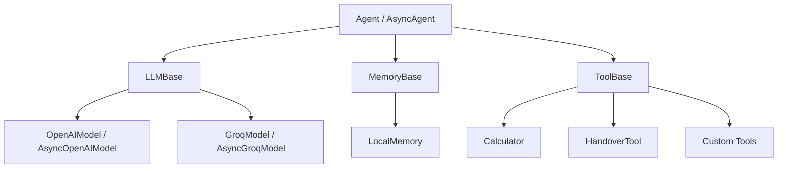

# Vantage

<p align="center">
    
</p>

**A lightweight, protocol-first Python library for building AI agents.**

[](https://github.com/saqlain2204/vantage/actions/workflows/ci.yml)
[](https://badge.fury.io/py/vantage)
[](https://www.python.org/)
[](https://opensource.org/licenses/MIT)
[](https://github.com/astral-sh/ruff)

Vantage is a modular Python library for building AI agents. It follows SOLID principles and defines every component — LLMs, tools, and memory — as an abstract interface, making each one independently replaceable without changing agent logic.

## Features

- **Simple YAML configuration**: Define agents, models, and tools in a flat, human-readable YAML file. No boilerplate.
- **Swappable components**: Implement `LLMBase`, `ToolBase`, or `MemoryBase` to replace any layer transparently.
- **Multi-agent flows**: Route requests between specialised agents with `HandoverTool`.
- **Sync and async**: Full async support with token streaming alongside the synchronous API.
- **Execution tracing**: Export a PNG diagram of every step in an agent's execution via `save_trace_png`.
- **Structured output**: Request JSON-schema-validated responses with a one-line field shorthand.

## Installation

```bash
pip install vantage
```

## Quick Start

### Python API

```python
from vantage.core import Agent
from vantage.llms import OpenAIModel
from vantage.memory import LocalMemory
from vantage.tools import Calculator

agent = Agent(
    llm=OpenAIModel(model="gpt-4o-mini"),
    tools=[Calculator()],
    memory=LocalMemory(),
    system_prompt="You are a math assistant.",
)

response = agent.run("What is (12 + 8) / 5?")
print(response.content)
```

### YAML configuration

Define agents in a YAML file — the `model` key sets both the provider and the model in one line:

```yaml
agents:
  calc_bot:
    model: groq/llama-3.3-70b-versatile
    system_prompt: "You are a math assistant. Use the calculator tool for arithmetic."
    tools: [calculator]
    response_schema:
      result: number
      explanation: string
```

```python
from vantage import run_yaml_agent
from vantage.tools import Calculator

resp = run_yaml_agent("agents.yaml", "calc_bot", "What is 15 * 12?", tools=[Calculator()])
print(resp.content)
```

`response_schema` accepts a flat `{field: type}` shorthand that is automatically expanded to a full JSON Schema. Supported types: `string`, `number`, `integer`, `boolean`, `array`, `object`.

### Async and streaming

```python
import asyncio
from vantage.core import AsyncAgent
from vantage.llms import AsyncOpenAIModel

agent = AsyncAgent(
    llm=AsyncOpenAIModel(model="gpt-4o-mini"),
    system_prompt="You are helpful.",
)

async def main() -> None:
    async for token in agent.stream("Explain gradient descent briefly."):
        print(token, end="", flush=True)

asyncio.run(main())
```

## Architecture



Every arrow in the diagram is an interface boundary — swap any node without touching the others.

## Extending Vantage

### Custom tool

```python
from vantage.core import ToolBase

class WeatherTool(ToolBase):
    @property
    def name(self) -> str:
        return "get_weather"

    @property
    def description(self) -> str:
        return "Return the current weather for a city."

    def input_schema(self):
        return {
            "type": "object",
            "properties": {"city": {"type": "string"}},
            "required": ["city"],
            "additionalProperties": False,
        }

    def execute(self, **kwargs) -> str:
        city = kwargs["city"]
        return f"Sunny, 22 C in {city}"   # replace with a real API call
```

### Custom LLM backend

```python
from vantage.core import LLMBase
from vantage.core.models import Message, Role

class MyLLM(LLMBase):
    def generate(self, messages, tools, response_schema=None) -> Message:
        # call your backend here
        return Message(role=Role.ASSISTANT, content="...")
```

## Multi-agent flows

```python
from vantage import run_yaml_agent, Calculator
from vantage.core.handovers import HandoverTool

tools = [
    Calculator(),
    HandoverTool("math_expert", "Transfer to the math expert."),
    HandoverTool("word_expert", "Transfer to the word expert."),
]

resp = run_yaml_agent("agents.yaml", "gatekeeper", "What is 6 * 7?", tools=tools)
print(resp.content)
```

## Execution tracing

Every `AgentResponse` carries a `trace` list. Render it as a PNG:

```python
from vantage import save_trace_png

save_trace_png(resp.trace, "trace.png")
```

The diagram shows every step — user input, LLM reasoning, tool calls, tool results, and the final answer — with the actual content of each step.

## Running the examples

```bash
git clone https://github.com/saqlain2204/vantage.git
cd vantage
pip install -e ".[dev]"
cp .env.example .env          # add your API keys

python -m examples.calculator_agent.run
python -m examples.custom_tool_agent.run
python -m examples.multi_agent_flow.run
```

## Contributing

Contributions are welcome. See [CONTRIBUTING.md](CONTRIBUTING.md) for the development setup, coding conventions, and how to submit a pull request.

## Changelog

See [CHANGELOG.md](CHANGELOG.md) for the version history.

## License

Vantage is released under the [MIT License](LICENSE).

